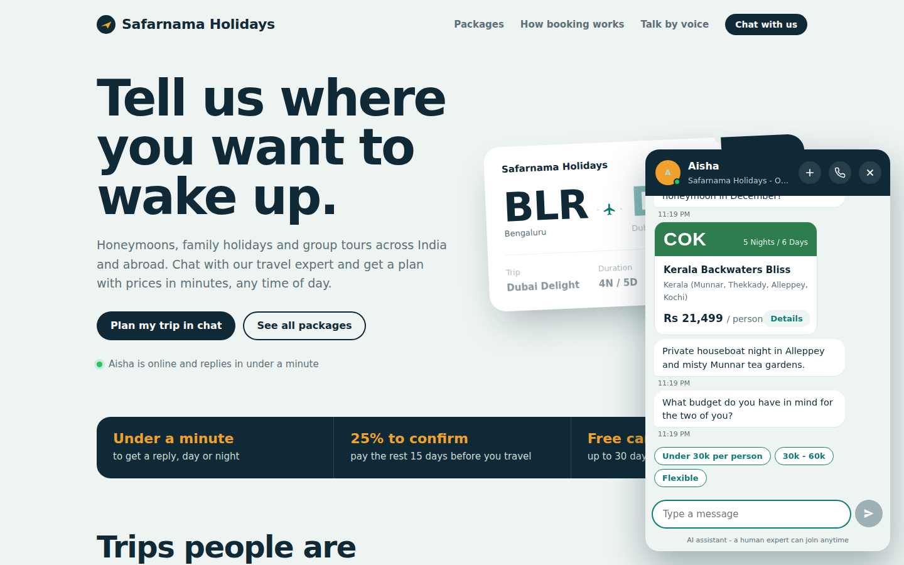
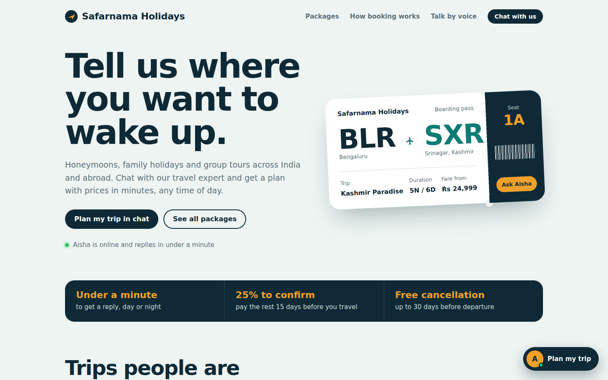
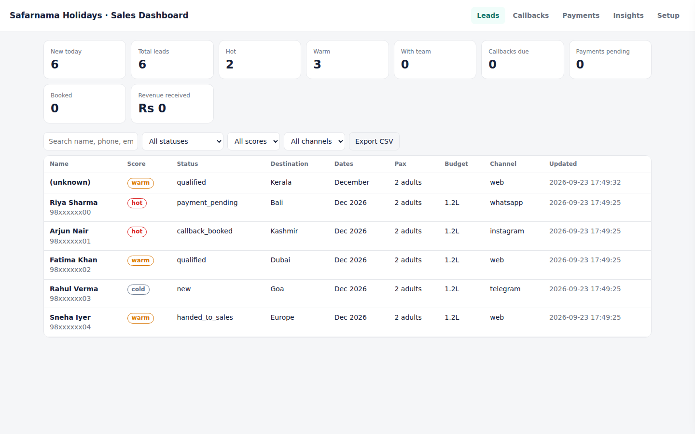
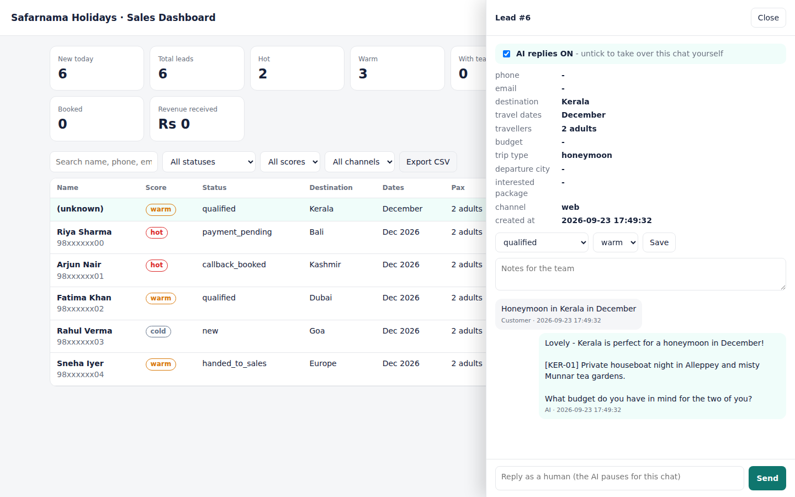
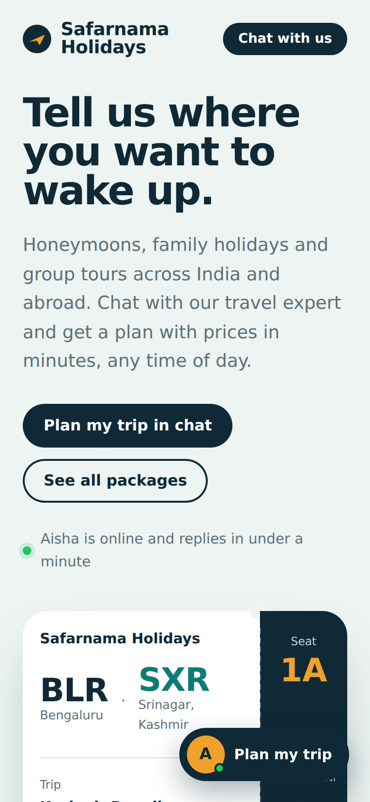
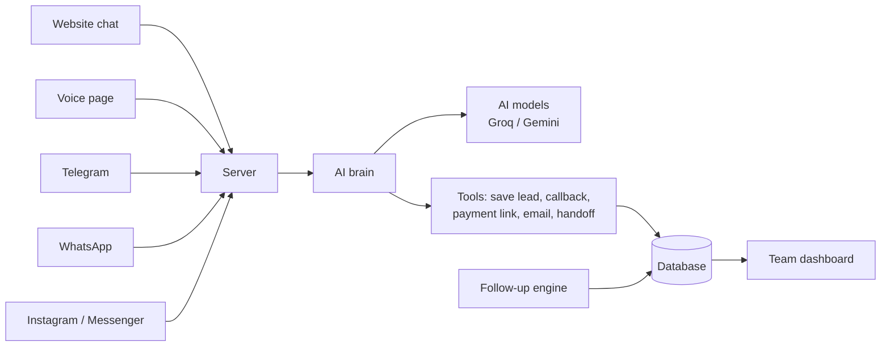

# AI Sales Agent for Travel Agencies

**A 24/7 AI salesperson that replies to every enquiry in seconds, qualifies the lead, recommends packages, sends payment links and hands serious buyers to the human sales team - on the website, voice, WhatsApp, Instagram and Telegram. Built entirely on free tools.**

**Live demo:** LIVE_DEMO_LINK
&nbsp;·&nbsp; Chat with *Aisha*, the AI travel consultant of a demo agency, *Safarnama Holidays*.

> The source code is kept private. This page explains what the project does, how it works and the decisions behind it. Happy to walk through the code on request.

---

## The problem

A typical travel agency has 4-5 salespeople whose day is mostly repetitive: answering the same questions about packages and prices, asking every lead the same qualifying questions, and chasing people who stopped replying.

Agencies lose customers because of:

- **Slow replies** - enquiries arrive at night and on weekends; by morning the customer has booked elsewhere.
- **Missed follow-ups** - when the team is busy, quiet leads are forgotten.
- **Scattered leads** - WhatsApp, Instagram, website and phone enquiries sit in personal phones and notebooks.
- **Time spent on non-buyers** - staff spend as long on browsers as on people ready to pay.

The agent handles the repetitive first part of every conversation, instantly and on every channel. People then spend their time only on leads that are ready to book.

## What it does

| Sales task | What the agent does |
| --- | --- |
| Reply to every enquiry | Answers in seconds, day or night, in the customer's language (English, Hindi, Hinglish, Malayalam...) |
| Explain packages and prices | Answers only from the company's own package list - it never invents a price |
| Qualify the lead | Asks destination, dates, travellers, budget, name and phone - one question at a time |
| Decide who is serious | Scores every lead **hot / warm / cold** |
| Send the itinerary | Emails full package details |
| Fix a phone call | Books a callback, alerts the team, emails a calendar invite |
| Take the booking advance | Creates a UPI / Razorpay payment link; the 25% advance is calculated by code, not by the AI |
| Hand over to a senior | Instant Telegram / email alert to the team with the full lead summary |
| Chase quiet leads | AI-written follow-ups after 20 hours, 3 days and 7 days |
| Let a human step in | Staff reply from the dashboard and the AI pauses for that chat |
| Report to the manager | Dashboard with leads, pipeline, callbacks, payments, revenue + a 9 AM daily report |

## Screenshots

| Website | Team dashboard |
| --- | --- |
|  |  |
| **Lead detail with full chat and human takeover** | **Mobile** |
|  |  |

## How it works

Every channel feeds one shared "brain", so the agent behaves the same everywhere and all leads land in one database.

1. **Channels** receive messages. Each is a small adapter that turns a Telegram, WhatsApp, Instagram or website message into one common format.
2. **The brain** builds the prompt - sales rules, company offers and policies, the package catalogue, what is already known about this customer, and the recent chat - and asks the AI model for a reply.
3. **Tools** are actions the AI can trigger (save lead, book callback, create payment link, email details, hand off). The AI decides *when*; plain Python code does the actual work, so data stays structured and amounts stay correct.
4. **Database and dashboard** store every lead, message, callback and payment and show them to the team.

### One conversation, step by step

A customer types *"Honeymoon in Kerala in December, 2 of us"*:

1. The chat widget sends the message to the server with a session id.
2. The server finds or creates the lead and stores the message.
3. The brain builds the prompt with the catalogue and everything known about this customer.
4. The AI replies and calls `save_lead_details` (Kerala, December, 2 adults, honeymoon, *warm*).
5. The code saves the details and returns the result to the AI, which writes the final reply (up to 6 tool rounds per turn).
6. The reply contains a tag like `[KER-01]`; the website renders it as a package card with the price, while WhatsApp and Telegram get it as text.
7. The widget shows it like a person would: typing dots, a delay based on length, short separate bubbles.

When the customer says *"Book it"*, the AI calls `create_payment_link`; the server looks up the price, calculates 25% x travellers, creates the payment page and alerts the team.

## Technology - and why

The rule for the whole project: **everything must be free to run.**

| Part | Tool | Why |
| --- | --- | --- |
| Language | Python | Readable, runs on any PC, huge ecosystem |
| Web server | FastAPI + Uvicorn | One lightweight server for the site, APIs and webhooks |
| AI models | Groq (gpt-oss, Llama, Qwen) + Google Gemini free tiers | Free keys; same OpenAI-compatible format, so one code path works for both |
| Offline AI | Ollama (optional) | Runs the model on your own PC - free and private |
| Database | SQLite | One file, nothing to install |
| Telegram | Telegram Bot API | Free, no public URL needed |
| WhatsApp | Meta WhatsApp Cloud API | Free test number; replies within 24 h are free |
| Instagram / Messenger | Meta Graph API | Free |
| Email | Gmail SMTP (App Password) | Free |
| Payments | UPI link + QR, Razorpay optional | UPI costs nothing |
| Voice | Browser speech APIs + Groq Whisper for voice notes | Built into Chrome, free |
| Public URL | Cloudflare Tunnel | Makes a home PC reachable by Meta webhooks, free |
| Live demo | Vercel (static site + one serverless function) | Free hosting |

No paid chatbot builders or CRMs - everything is custom code, so it can be changed freely.

## Design decisions

- **One brain, many channels.** A new channel is a small adapter; the sales logic is written once.
- **The AI never invents prices.** It only sees the company's catalogue, and payment amounts are computed by code.
- **Tools instead of free text.** Leads and payments go through fixed functions, so the data is reliable.
- **A human can always take over** from the dashboard; the AI goes quiet for that chat.
- **Respecting WhatsApp's 24-hour rule** - later follow-ups switch to email or stop, instead of paid templates.
- **Human-like chat** - typing indicator, realistic delays, short multi-bubble replies, one question at a time.
- **Never down because of one AI provider** - a router tries a list of free models across providers, skips retired ones (404), rests rate-limited ones (429) and remembers the one that works.

## Problems solved while building it

| Problem | Cause | Fix |
| --- | --- | --- |
| Bot replied "technical issue" | Gemini's free daily quota ran out (429) | Automatic fallback across free models and providers |
| Groq model not found (404) | Providers retire models often | Per-provider model lists; dead models are skipped automatically |
| Old code kept answering | Several server copies were sharing port 8000 on Windows | Server refuses to start if a copy is already running |
| Package tags looked odd on Telegram | Chat apps can't show cards | Tags become readable text on non-website channels |

## Honest limits

- Real **phone calls** to mobile numbers always cost per minute - the free version offers browser voice and voice notes instead.
- **Free AI tiers** have daily limits; heavy traffic needs a paid tier or a local model.
- Free-tier AI services may use conversations to improve their products - for real customer data use Ollama or a paid tier.
- **WhatsApp marketing** messages after 24 hours need paid templates.

## Roadmap

- [ ] Real agency data and WhatsApp Business number
- [ ] 24/7 hosting of the full app on a free cloud VM
- [ ] Phone-calling voice agent (Pipecat / LiveKit + telephony)
- [ ] Knowledge search over brochure PDFs for large catalogues

## About the live demo

The public demo runs on Vercel as a static site plus one small serverless function that talks to the free AI models. It is stateless (no database), limited to a number of messages per visitor, and does not take real bookings. The full app - with lead storage, payments, callbacks, follow-ups, WhatsApp / Instagram / Telegram and the team dashboard - runs as a normal Python server.
